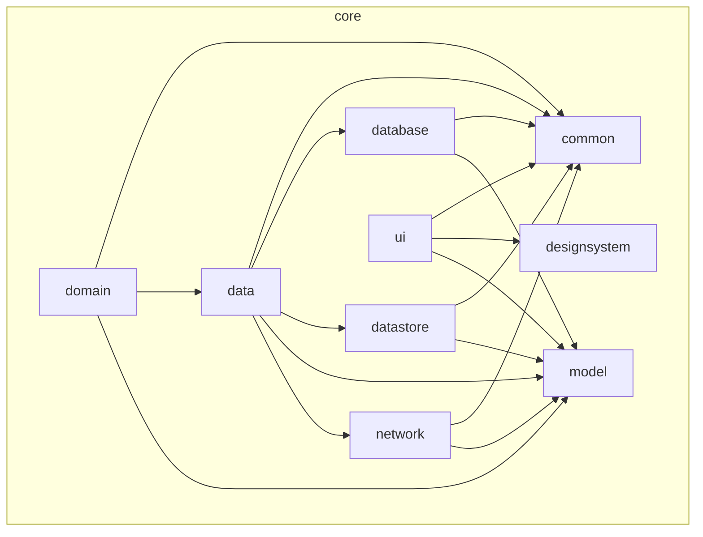

# JetpackMovieCompose

一個使用 Jetpack Compose 和 [TMDB API](https://www.themoviedb.org/documentation/api) 打造的現代化 Android 電影資訊 App。此專案展示了最新的 Android 開發實踐，包含多模組架構、Clean Architecture、以及 Jetpack 生態系中的各種元件。

## 主要功能 (Features)

- **電影探索**: 瀏覽熱門、即將上映、和高評分的電影。
- **電影搜尋**: 透過關鍵字即時搜尋電影。
- **詳細資訊**: 查看電影的詳細介紹、預告片、評分和演員陣容。
- **演員專頁**: 點擊演員以查看其簡介和參與的電影作品。
- **個人收藏**: 將喜歡的電影加入收藏清單以便日後查看。
- **主題切換**: 支援深色與淺色主題模式。

## 螢幕截圖 (Screenshots)

| 首頁 | 電影詳情 |
| :---: | :---: |
| <!-- 在此處插入首頁截圖 --> | <!-- 在此處插入詳情頁截圖 --> |

| 搜尋 | 收藏清單 |
| :---: | :---: |
| <!-- 在此處插入搜尋頁截圖 --> | <!-- 在此處插入收藏頁截圖 --> |

## 技術棧與關鍵函式庫 (Tech Stack & Key Libraries)

- **UI**: [Jetpack Compose](https://developer.android.com/jetpack/compose) - 用於建構原生 UI 的現代化工具包。
- **語言**: [Kotlin](https://kotlinlang.org/) - 主要開發語言。
- **非同步處理**: [Coroutines](https://kotlinlang.org/docs/coroutines-overview.html) & [Flow](https://developer.android.com/kotlin/flow) - 用於處理非同步任務和資料流。
- **架構**: 
  - 多模組 (Multi-module) 架構
  - Clean Architecture (分層式架構)
  - MVVM (Model-View-ViewModel)
- **依賴注入**: [Hilt](https://developer.android.com/training/dependency-injection/hilt-android) - 簡化 Android 的依賴注入。
- **網路請求**: [Retrofit](https://square.github.io/retrofit/) & [OkHttp](https://square.github.io/okhttp/) - 強大且高效的 HTTP 客戶端。
- **資料庫**: [Room](https://developer.android.com/training/data-storage/room) - 在本地持久化儲存資料。
- **分頁載入**: [Paging 3](https://developer.android.com/topic/libraries/architecture/paging/v3-overview) - 漸進式地從遠端或本地載入資料。
- **資料儲存**: [Proto DataStore](https://developer.android.com/topic/libraries/architecture/datastore) - 安全且高效地儲存鍵值對或型別物件。
- **圖片載入**: [Coil](https://coil-kt.github.io/coil/) - 基於 Kotlin Coroutines 的圖片載入庫。

## 專案架構 (Architecture)

本專案採用了現代化的**多模組 (Multi-module)** 架構，將程式碼按照功能和分層進行隔離，以達到高內聚、低耦合的目標。整體架構遵循 **Clean Architecture** 的原則，分為三個主要層次：`feature`、`core` 和 `app`。

- **`app` 層**: 負責整合所有模組，建立依賴注入圖，並作為應用程式的進入點。
- **`feature` 層**: 包含所有獨立的功能模組 (如首頁、搜尋、電影詳情等)。每個 `feature` 模組都擁有自己的 UI 和 ViewModel，並透過 `domain` 層與資料層互動。
- **`core` 層**: 提供了所有 `feature` 模組共享的基礎建設和業務邏輯。它進一步細分為：
  - `ui`: 共享的 Compose 元件。
  - `domain`: 包含 UseCases 和業務邏輯。
  - `data`: 資料儲存庫 (Repository) 的實作，負責協調遠端和本地資料來源。
  - `network`: 處理所有遠端 API 請求。
  - `database`: Room 資料庫的定義和 DAOs。
  - `datastore`: Proto DataStore 的實作。
  - `model`: 定義了整個應用程式共用的資料模型。
  - `designsystem`: 定義 App 的顏色、字體和主題。
  - `common`: 共享的工具類和擴充函式。

### Core 模組依賴圖

以下是 `core` 內部各模組的依賴關係圖：



## 如何開始 (Getting Started)

請依照以下步驟在本機環境中建置並執行專案：

### 1. Clone 專案

```bash
git clone https://github.com/your-username/JetpackMovieCompose.git
cd JetpackMovieCompose
```

### 2. 設定 API 金鑰

本專案需要使用 The Movie Database (TMDB) 的 API 金鑰才能取得電影資料。請依照以下步驟設定：

1.  前往 [TMDB 網站](https://www.themoviedb.org/signup) 註冊一個帳號並申請一組 API 金鑰。
2.  在專案的根目錄下，找到 `key.properties` 檔案。如果檔案不存在，請自行建立一個。
3.  在 `key.properties` 檔案中，加入您的 API 金鑰，格式如下：

    ```properties
    API_KEY="YOUR_TMDB_API_KEY"
    ```

    **注意**: `key.properties` 已被加入 `.gitignore` 中，以確保您的金鑰不會被上傳到版本控制系統。

### 3. 建置並執行

一切就緒後，您可以使用 Android Studio 開啟專案，並點擊 "Run" 按鈕來建置和執行應用程式。

或者，您也可以使用以下 Gradle 指令：

```bash
# 在您的裝置或模擬器上安裝 Debug 版本的 App
./gradlew installDebug
```

## 授權 (License)

```
Copyright 2025 Your Name

Licensed under the Apache License, Version 2.0 (the "License");
you may not use this file except in compliance with the License.
You may obtain a copy of the License at

    http://www.apache.org/licenses/LICENSE-2.0

Unless required by applicable law or agreed to in writing, software
distributed under the License is distributed on an "AS IS" BASIS,
WITHOUT WARRANTIES OR CONDITIONS OF ANY KIND, either express or implied.
See the License for the specific language governing permissions and
limitations under the License.
```
